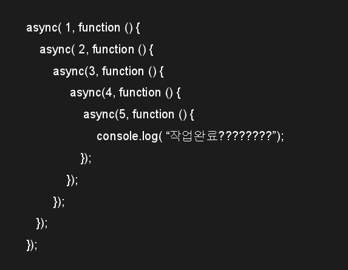
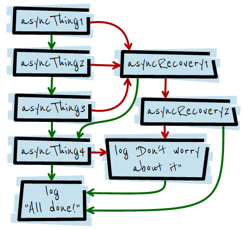

# promise란? 나온 이유

먼저 promise가 나온 이유는 아래 그림과 같은 콜백 지옥 때문이다.



비동기함수를 단순히 콜백함수로만 처리를 해주면 비동기 함수를 점점 타고 들어가면서 콜백 지옥에 빠지게 됩니다. 이에 따라 가독성도 떨어집니다.
promise를 사용하여 코드를 잘 짜면 이런 콜백 헬을 해결할 수 있습니다.
그리고 비동기 함수들을 쉽게 관리할 수 있다는 느낌이 들었습니다.(개인적인 생각..)

그럼 promise란 무엇인가.
정의를 읽어도 잘 이해가 안가서 코드를 먼저 보았습니다.

``` javascript
//Promise 선언
var mypromise = function (param) {

	return new Promise(function (resolve, reject) {

		// 비동기를 표현하기 위해 setTimeout 함수를 사용 
		window.setTimeout(function () {

			// 파라메터가 참이면, 
			if (param) {

				// 해결됨 
				resolve("해결 완료");
			}

			// 파라메터가 거짓이면, 
			else {

				// 실패 
				reject(Error("실패!!"));
			}
		}, 3000);
	});
};

//Promise 실행
mypromise(true)
.then(function (text) {
	// 성공시
	console.log(text);
}, function (error) {
	// 실패시 
	console.error(error);
});
```
promise는 영어로 '약속'이다. "아직 처리 안했는데 처리하고 이상 없으면 알려줄게"라는 약속이다. 이에 따라 상태가 4가지가 있다.
1. peding: 아직 약속을 수행중인 상태
2. fulfilled: 약속이 지켜진 상태
3. rejected: 약속이 못 지켜진 상태
4. settled: 약속이 어떻게 되든 결론이 난 상태

코드를 보면 promise는 객체입니다. promise 객체는 resolve,reject를 파라미터로 하는 익명함수를 감싸고 있는데 resolve나 reject가 실행되기 전까지의 상태는 pending입니다. 이후 비동기 작업을 처리하고 결과를 약속대로 잘 줄 수 있으면 resolve, 실패하면 reject함수를 호출합니다.
그리고 아래 부분의 promise 실행부분을 보면 mypromise()를 호출하면 Promise 객체가 리턴되고, 정상적으로 비동기 작업이 완료되면 .then 안의 익명함수를 실행한다.

마지막으로 체이닝형태로 연결된 상태의 비동기 작업이 중간에 에러가 났을 때 처리해주는 promise.catch가 있습니다.
```
mypromise(true)
	.then(JSON.parse)
	.catch(function () { 
		window.alert('체이닝 중간에 에러!!');
	})
	.then(function (text) {
		console.log(text);
	});
```
위 코드와 같이 .catch를 이용하여 에러처리를 할 수 있습니다.

promise의 실행 순서를 이해하는데 좋은 코드와 그림이 있어 가져왔습니다.

```
asyncThing1()
	.then(function() { return asyncThing2();})
	.then(function() { return asyncThing3();})
	.catch(function(err) { return asyncRecovery1();})

	.then(function() { return asyncThing4();}, function(err) { return asyncRecovery2(); })
	.catch(function(err) { console.log("Don't worry about it");})

	.then(function() { console.log("All done!");});
  ```
위 로직의 실행순서를 그림으로 표현하면 아래와 같습니다.
 
  

대충 정리한 내용인데 자세한 내용은 [링크](https://programmingsummaries.tistory.com/325)를 참조하자.
